# HyFive Deployment Overview

This guide provides instructions for deploying HyFive using containers on 
kubernetes. It covers environment setup, database configuration, and user 
management integration.

## Fetching the code for the system

The code for the HyFive application is available at 
[github.com/EU-ECDC/HyFive](https://github.com/EU-ECDC/HyFive). To create a 
local copy of the repository for deployment, click the green button on the 
page that says `<> Code 🞃`, and select one of the "Clone" options.

This will create a local copy of the full source code and deployment code.
This is recommended for deployment, and local testing.

If you wish to contribute to the code, or to create your own project based
on this source code, you should instead use the gray "Fork" button to make
a clone of the repository under your github user or organisation.

## Overview of the system

The HyFive system has two application parts, the observation interface and the 
administration interface. The observation interface is used in facilities for 
hand hygiene observation, and the administation interface is used to work with
the data collected from observations as well as assign user roles.

Data from observations are stored in a PostgreSQL database, which the 
administration interface reads. It is possible to deploy only the observation
interface for data collection, but a separate system would then be needed to 
consume the collected data and assign user roles.

User authentication is done by connecting to a Single Sign-On provider using 
the OpenID Connect (OIDC) protocol. This allows the app to be connected to 
most organisations existing user management system to avoid requiring users to
have multiple sets of credentials.



## Security considerations

We have done our best to make this a secure product, but there are a number of 
things that need to be considered when deploying to further improve security.
First of all **Consult your IT department to review how this product fits into
your current infrastructure and security requirements.**

Some other considerations:
 - How should sensitive values used for deployment be stored and handled?
 - Can the app be served only on an internal network instead of externally 
   accessible?
 - Who should have access to the observation and admin interfaces?
 - What access monitoring and alerting can be used?

## Deployment Environment

While not strictly necessary, it's recommended to start by deploying the system
to a non-production environment. This is useful for reviewing permissions, 
testing the configuration, and training users without producing "junk data" in 
the production system. 

The testing system does of course not have the same security requirements as a
production system, but our recommendation is to set up a system as similar to 
what is needed for production as possible.

## Configuration of the system

Regardless of deployment option, there are a number of things that need to be
configured for the solution to run. Where possible, sane defaults are used to
minimize the amount of configuration needed.

The full configuration options for the Observation and Admin modules are 
available in their respective `settings.json` files, located at:

 - Observation: [HyFive.Observation/appsettings.json](../../HyFive.Observation/appsettings.json)
 - Admin: [HyFive.Admin/appsettings.json](../../HyFive.Admin/appsettings.json)

These are standard .NET settings and can be overwritten with environment 
variables by using `__` to join nested json settings. 

ex.
```json
{
  "Logging": {
    "LogLevel": {
      "Default": "Information",
    }
  }
}
```
can be overwritten like:
```yaml
env:
  Logging__LogLevel__Default: "Warning"
```
to change the default log level from `Information` to `Warning`.

### Configuring the database connection

The HyFive system uses a PostgreSQL database for data storage. The solution has
been tested using PostgreSQL 16, but is likely to work with newer versions as 
well.
Both the Obervation and Admin containers expect a connection string as part of
the settings to connect to this database. This is a standard PostgreSQL 
connection string, commonly formatted like 
`Server=; Database=; Username=; Password=`. A full list of connection string 
options is available in the 
[npgsql documentation](https://www.npgsql.org/doc/connection-string-parameters.html).

#### Configuring the database connection for helm

If deploying the PostgreSQL database in the cluster using the helm chart, no 
configuration is needed. Username and database name may be changed but the 
host will be set by helm, and the password can be left empty to generate a 
secure password.

When using a predeployed database, add the connection credentials in the 
[values](../../infra/helm-chart/values.yaml) file before deploying. 

**Note**: Adding secrets to the values file requires the values file to be 
kept secure.

### Configuring Single Sign-On

To enable integration with organization Single Sign-On (SSO) systems, HyFive 
user access is configured using OpenID Connect (OIDC). The following settings
need to be provided to connect to an OIDC provider:

```json
"OpenIdConnect": {
  "AuthUse": "true",
  "Authority": "",
  "ClientId": "",
  "ClientSecret": ""
},
```

The `Authority`, `ClientId`, and `ClientSecret`values need to be obtained from 
the SSO system and set here. Setting these values will connect the HyFive 
system to the SSO provider. A few more settings are required to inform HyFive 
which values should be used for authorization though.

First of all are the claim types, which describe to HyFive which values should
be used to infer access role, environment access, user display name, and user 
unique ID.

```json
"ClaimTypes": {
  "RoleClaimType": "http://sso/role/atom",
  "EnvironmentAccessClaimType": "http://sso/supo/env",
  "DisplayNameClaimType": "http://sso/displayName",
  "UniqueIdentifierClaimType": "http://sso/guid"
},
```

These are combined with the following settings to configure which users have 
which access:

```json
  "Security": {
    "EnvironmentAccess": "TEST",
  }
```

Sets the value which needs to be present in the field referenced in the 
`ClaimTypes.EnvironmentAccessClaimType` setting to have access to the deployed
environment. 

ex.

```json
"ClaimTypes": {
  "EnvironmentAccessClaimType": "http://sso/supo/env",
},
"Security": {
  "EnvironmentAccess": "TEST",
}
```
means that the value at `http://sso/supo/env` in the user JWT needs to be set
to `"TEST"` to have access to the environment. 

The `"RoleClaimType"` is then used to define the field that should be used for 
role assignment. This is commonly the email address field in the SSO provider. 
The user role assignment is done in the admin application, referencing this 
field.
Note that this means that the initial administrator needs to be added "by hand"
in the database.
ex.
```SQL
DO $$
DECLARE
  adminId INTEGER; -- Variable to store the returned ID
BEGIN
  -- Insert user and capture the generated ID
  INSERT INTO "User" ("LastName","FirstName","CreatedTime","IsDeactivated","Email")
  VALUES ('Min', 'Ada', NOW(), FALSE, 'ad@m.in')
	RETURNING "Id" INTO adminId;

  -- Insert admin permission for user
	INSERT INTO public."UserPermission" ("PermissionLevel", "UserId", "OrganisationUnitId", "CreatedAt", "CreatedBy", "LastModified", "LastModifiedBy") 
	VALUES('Administrator', adminId, null, now(), 'db admin', now(), 'db admin');
END;
$$;
```

#### Redirect pages

In addition to the OpenID Connect settings above, HyFive also requires
configuration of the login and logout redirect URIs. These are used by the
identity provider to return the user to the application after authentication
and to direct the user to a landing page after logout.

These values must be configured for **both the Admin and Observation** projects.

```yaml
RedirectPagesSettings__RedirectLogInUri: "https://<your-admin-domain>/signin-oidc"
RedirectPagesSettings__RedirectLogOutUri: "https://<your-admin-domain>/"

RedirectPagesSettings__RedirectLogInUri: "https://<your-observation-domain>/signin-oidc"
RedirectPagesSettings__RedirectLogOutUri: "https://<your-observation-domain>/"
```

**RedirectLogInUri**: The callback URI where the identity provider should
send the user after a successful login. For both modules this is normally the
/signin-oidc endpoint.

**RedirectLogOutUri**: The page the user should be redirected to after logging
out. This is usually the root of the respective application or a public landing page.

Choosing the domain:

Replace <your-admin-domain> and <your-observation-domain> with the actual
publicly accessible domain names (or load balancer / ingress hostnames) for the
Admin and Observation deployments in your environment.

**Important**: These values must exactly match the redirect URIs registered
for the application in the Single Sign-On system. If they differ, sign-in and
sign-out will fail.

## Deploy the Database

HyFive supports three database deployment modes:

 - Local: Run the database on the same host as the application.
 - Remote: Connect to an existing remote database.
 - Container: Deploy the database in a container.

The available helm charts can deploy a postgresql database that is sufficient 
for development, allowing for quick deployment and configuration. This helm 
chart isnot configured for high availability and does not include backups 
though. So 
**For production deployments, we recommend using a remote managed database.**

If you are making a local database deployment, the best resource for install 
information is [the official site](https://www.postgresql.org/download/).

## Set up single sign-on user management

HyFive is configured to use Single Sign-On (SSO) user management using OpenID
Connect (OIDC). This means that users are not handled inside HyFive itself, they
are handled inside a separate system, such as PingOne, Google Identity Platform,
or Microsoft Entra ID. HyFive is added as a trusted app in the this identity 
platform, and HyFive is configured to trust the provider. 

This step is important but as SSO providers have different interfaces, we can 
only provide general information.

The setup will be something like this:

 - Create an app registration for HyFive in the SSO system.
 - Make sure that user groups are created for HyFive Observers and Administrators (and users added to these groups)
 - Make sure that SSO values are available for:
   - user role
   - user environment access 
   - user display name
   - user unique id
 - Configure HyFive with the corresponding values

The Environment Access value is mainly used if there are multiple environments
(such as when running one production system and one training system) but is 
required even if there is only one system deployed.

## Deploy the containers

### Running locally with compose

The solution contains the [compose.yml](../../compose.yml) file,
which can be used to run a local version of the system using a container 
orchestrator. This has been tested using docker compose and podman compose.

to start the environment using docker:
```bash
docker compose up
```

or using podman:
```bash
podman compose up 
```

This should result in the system becoming available at http://localhost:8080.

Note that the compose project does not include a Single Sign-On (SSO) provider,
so user management needs to be plugged in.

### Deploying the containers on Kubernetes using Helm

These instructions assume that you are interfacing with your kuberentes cluster
using the command line interfaces. If you use a different interface, adapt the 
instructions.

1. Ensure the Kubernetes target is available and reachable.

```bash
kubectl get pods
```
This command should list the available pods running on the kuberenetes cluster.
What is running is not important, just that you can connect to the cluster.

2. Helm is installed.

```bash
cd infra/helm-chart
helm -h
```

This should show the helm help screen. If helm isn't installed, follow the 
instructions at [helm.sh](https://helm.sh/docs/intro/install/) to install helm,
then continue following the instructions.

3. Edit `values.yaml` with your settings.

The [values.yaml`](../../infra/helm-chart/values.yaml) file is used to populate
the helm templates when deploying, thus they need to be updated with the 
settings for your deployment. The file itself includes comments to help you 
configure. See the [Configuration](configuration.md) instructions for additional
help.

**Note that if password or keys are added to the `values.yaml` file, it needs to
be handled as a sensitive data and should be kept securely.**

4. Deploy

Run:
```bash
helm upgrade --install <name> . --values values.yaml
```
where `<name>` is the name of your deployment. This is commonly the name of the
environment that's being deployed to, such as `dev`. The `<name>` value will be 
used as a prefix for all the deployed resources, allowing multiple instances to
be deployed if needed.

5. Monitor pods and services for successful startup.

There are several way to monitor the deployment procedure, but a simple one is
running:

```bash
watch kubectl get pods
```
which will show you the running containers, updating every 3 seconds. 
Should the containers fail to deploy, review the settings and then run the 
upgrade command again to update the settings.

General information for troubleshooting is available in the 
[Kubernetes documentation](https://kubernetes.io/docs/tasks/debug/debug-application/)
as well.
